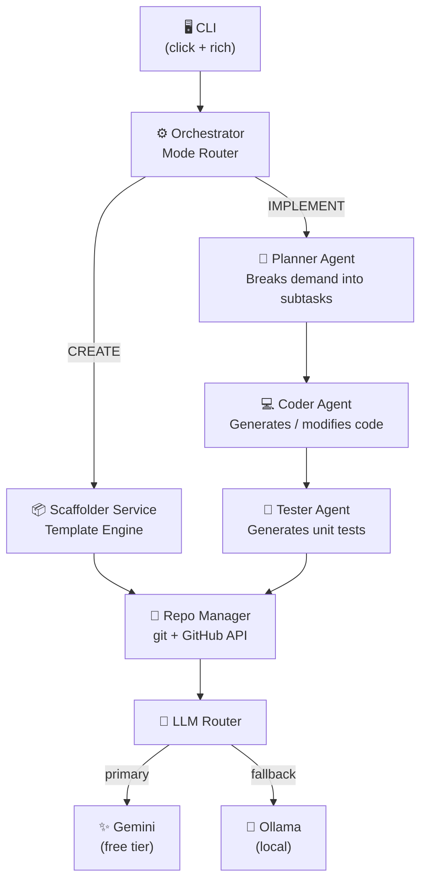
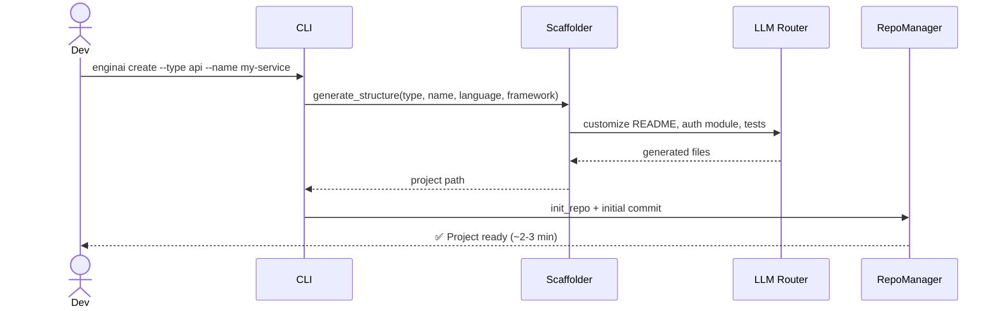
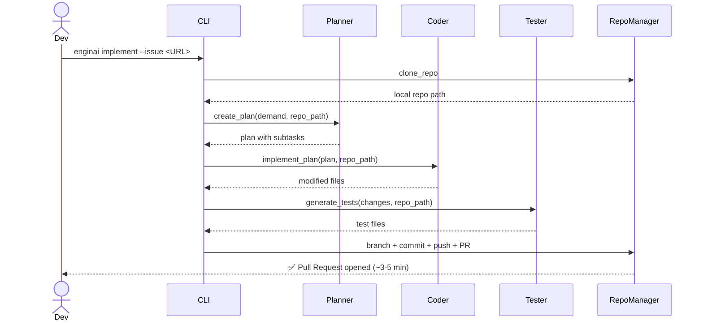
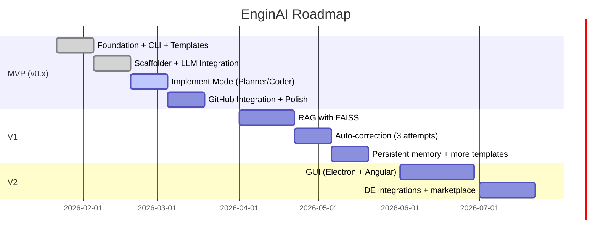

<](https://python.org)
[](LICENSE)
[](https://aistudio.google.com)
[](docs/mvp%20spec.md)

</div>

---

## What is EnginAI?

EnginAI is a CLI agent that combines **Gemini** (free) and **Ollama** (local) to automate two core developer workflows:

- **`create`** — Scaffolds a complete project (API, webapp, script) from a single command
- **`implement`** — Reads a GitHub Issue or text description, codes the feature, generates tests, and opens a Pull Request automatically

Zero cloud costs. Runs entirely on free-tier and local models.

---

## ✨ Features

| Feature | Description |
|---|---|
| 🆕 **CREATE** | Generates APIs, web apps, and scripts from scratch |
| 🔧 **IMPLEMENT** | Implements features in existing repos via Issue or text |
| 🧪 **AUTO TESTS** | Automatically generates unit tests for every change |
| 🤖 **LLM ROUTING** | Uses Gemini (primary) with Ollama as local fallback |
| 🐙 **GIT NATIVE** | Branches, commits, and opens PRs automatically |
| 💸 **ZERO COST** | Gemini free tier + Ollama local = $0.00/month |

---

## 🏗️ Architecture



---

## 🔄 Workflows

### CREATE — New project from scratch



### IMPLEMENT — Feature in existing repo



---

## 📁 Project Structure

```
enginai/
├── src/
│   ├── agents/
│   │   ├── planner.py       # Breaks demand into subtasks
│   │   ├── coder.py         # Generates and modifies code
│   │   └── tester.py        # Generates unit tests
│   ├── core/
│   │   ├── orchestrator.py  # Main flow coordinator
│   │   └── model_router.py  # Routes requests to Gemini or Ollama
│   ├── services/
│   │   └── scaffolder.py    # Project structure generation
│   ├── adapters/
│   │   └── repo_manager.py  # Git & GitHub operations
│   └── cli/
│       └── main.py          # CLI entry point
├── docs/
│   ├── mvp spec.md          # MVP specification
│   ├── tech spec.md         # Technical specification
│   └── stack.md             # Stack & infrastructure details
├── .env.example
├── requirements.txt
└── README.md
```

---

## 🚀 Installation

```bash
# 1. Clone the repository
git clone https://github.com/ElioNeto/enginai.git
cd enginai

# 2. Install dependencies
pip install -r requirements.txt

# 3. Configure environment
cp .env.example .env
# Edit .env with your API keys (see Configuration section)
```

---

## ⚙️ Configuration

Copy `.env.example` to `.env` and fill in your keys:

```bash
# App
APP_ENV=dev
LOG_LEVEL=INFO
WORKDIR=~/.enginai/workspace

# GitHub
GITHUB_TOKEN=ghp_...           # https://github.com/settings/tokens
DEFAULT_BASE_BRANCH=main

# LLMs
GEMINI_API_KEY=AIzaSy...       # https://aistudio.google.com/apikey
GEMINI_DAILY_LIMIT=1450
OLLAMA_HOST=http://localhost:11434

# Templates
TEMPLATES_DIR=~/.enginai/templates
DEFAULT_AUTHOR=Your Name
DEFAULT_LICENSE=MIT
```

---

## 🛠️ Usage

```bash
# --- CREATE: new project from scratch ---
enginai create --type api --name user-service --language python --framework fastapi
enginai create --type api --name user-service --language python --framework fastapi --database postgres --auth
enginai create --type webapp --name dashboard --framework angular
enginai create --type script --name data-processor

# --- IMPLEMENT: feature in existing repo ---
enginai implement --issue "https://github.com/user/repo/issues/42"
enginai implement --text "add GET /users endpoint" --repo "https://github.com/user/repo"

# --- UTILS ---
enginai config --check
enginai templates --list
```

---

## 🗺️ Roadmap



---

## 📖 Documentation

- [MVP Specification](docs/mvp%20spec.md)
- [Technical Specification](docs/tech%20spec.md)
- [Stack & Infrastructure](docs/stack.md)

---

## 📄 License

MIT © [Elio Neto](https://github.com/ElioNeto)
]]>