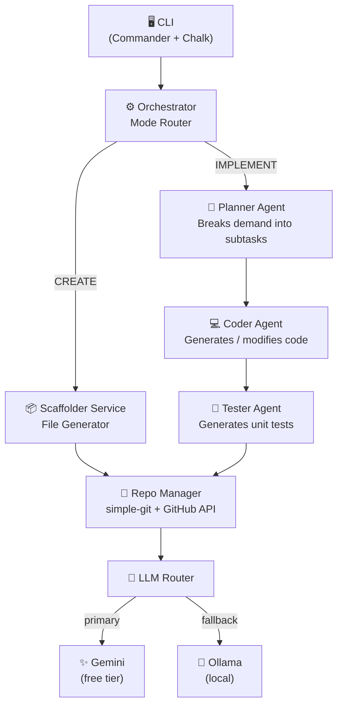
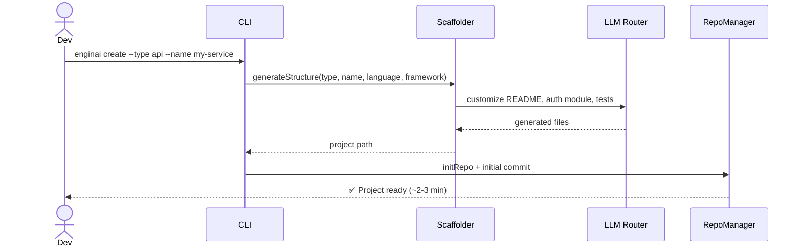
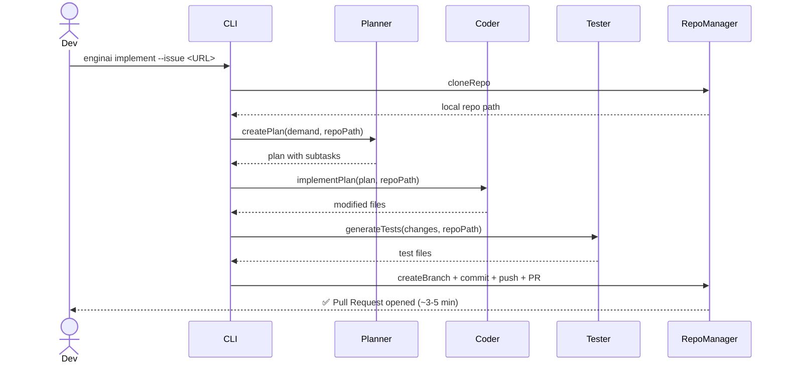
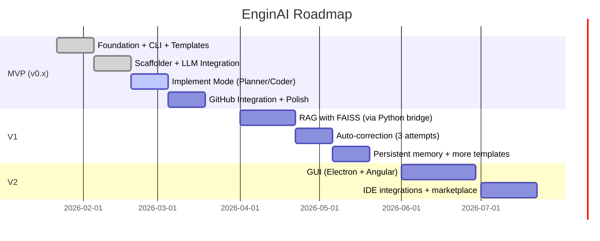

<div align="center">

# ⚙️ EnginAI

**AI-powered developer agent that creates full applications from scratch and implements features automatically.**

[](https://nodejs.org)
[](https://typescriptlang.org)
[](LICENSE)
[](https://aistudio.google.com)
[](docs/mvp%20spec.md)

</div>

---

## What is EnginAI?

EnginAI is a CLI agent built with **Node.js + TypeScript** that combines **Gemini** (free) and **Ollama** (local) to automate two core developer workflows:

- **`create`** — Scaffolds a complete project (API, webapp, script) from a single command
- **`implement`** — Reads a GitHub Issue or text description, codes the feature, generates tests, and opens a Pull Request automatically

Zero cloud costs. Runs entirely on free-tier and local models.

---

## ✨ Features

| Feature | Description |
|---|---|
| 🆕 **CREATE** | Generates APIs, web apps, and scripts from scratch |
| 🔧 **IMPLEMENT** | Implements features in existing repos via Issue or text |
| 🧪 **AUTO TESTS** | Automatically generates unit tests for every change |
| 🤖 **LLM ROUTING** | Uses Gemini (primary) with Ollama as local fallback |
| 🐙 **GIT NATIVE** | Branches, commits, and opens PRs automatically |
| 💸 **ZERO COST** | Gemini free tier + Ollama local = $0.00/month |

---

## 🏗️ Architecture



---

## 🔄 Workflows

### CREATE — New project from scratch



### IMPLEMENT — Feature in existing repo



---

## 📁 Project Structure

```
enginai/
├── src/
│   ├── agents/
│   │   ├── planner.ts         # Breaks demand into subtasks
│   │   ├── planner.test.ts    # Unit tests
│   │   ├── coder.ts           # Generates and modifies code
│   │   └── tester.ts          # Generates unit tests
│   ├── core/
│   │   ├── orchestrator.ts    # Main flow coordinator
│   │   └── modelRouter.ts     # Routes requests to Gemini or Ollama
│   ├── services/
│   │   └── scaffolder.ts      # Project structure generation
│   ├── adapters/
│   │   ├── repoManager.ts     # Git & GitHub operations
│   │   └── repoManager.test.ts
│   ├── config/
│   │   └── index.ts           # Environment config loader
│   ├── types/
│   │   └── index.ts           # Shared TypeScript types
│   └── cli/
│       └── main.ts            # CLI entry point (Commander)
├── docs/
│   ├── mvp spec.md            # MVP specification
│   ├── tech spec.md           # Technical specification
│   └── stack.md               # Stack & infrastructure details
├── dist/                      # Compiled output (generated)
├── .env.example
├── package.json
├── tsconfig.json
├── jest.config.ts
└── README.md
```

---

## 🚀 Installation

```bash
# Prerequisites: Node.js 20+ (https://nodejs.org)

# 1. Clone the repository
git clone https://github.com/ElioNeto/enginai.git
cd enginai

# 2. Install dependencies
npm install

# 3. Build the project
npm run build

# 4. Configure environment
cp .env.example .env
# Edit .env with your API keys (see Configuration section)

# 5. (Optional) Install globally
npm install -g .
```

---

## ⚙️ Configuration

Copy `.env.example` to `.env` and fill in your keys:

```bash
# App
APP_ENV=dev
LOG_LEVEL=INFO
WORKDIR=~/.enginai/workspace

# GitHub
GITHUB_TOKEN=ghp_...           # https://github.com/settings/tokens
DEFAULT_BASE_BRANCH=main

# LLMs
GEMINI_API_KEY=AIzaSy...       # https://aistudio.google.com/apikey
GEMINI_DAILY_LIMIT=1450
OLLAMA_HOST=http://localhost:11434
OLLAMA_MODEL=qwen2.5-coder:7b

# Templates
TEMPLATES_DIR=~/.enginai/templates
DEFAULT_AUTHOR=Your Name
DEFAULT_LICENSE=MIT
```

---

## 🛠️ Usage

```bash
# --- CREATE: new project from scratch ---
enginai create --type api --name user-service --language python --framework fastapi
enginai create --type api --name user-service --language typescript --framework express --database postgres --auth
enginai create --type webapp --name dashboard --framework angular
enginai create --type script --name data-processor

# --- IMPLEMENT: feature in existing repo ---
enginai implement --repo https://github.com/user/repo --issue https://github.com/user/repo/issues/42
enginai implement --repo https://github.com/user/repo --text "add GET /users endpoint"

# --- UTILS ---
enginai config --check

# --- DEV (without build) ---
npx ts-node src/cli/main.ts create --type api --name demo --language typescript --framework express
```

---

## 🧪 Tests

```bash
npm test                # Run all tests
npm run test:coverage   # Run with coverage report
npm run typecheck       # TypeScript type checking only
npm run lint            # ESLint
```

---

## 🗺️ Roadmap



---

## 📖 Documentation

- [MVP Specification](docs/mvp%20spec.md)
- [Technical Specification](docs/tech%20spec.md)
- [Stack & Infrastructure](docs/stack.md)

---

## 📄 License

MIT © [Elio Neto](https://github.com/ElioNeto)
