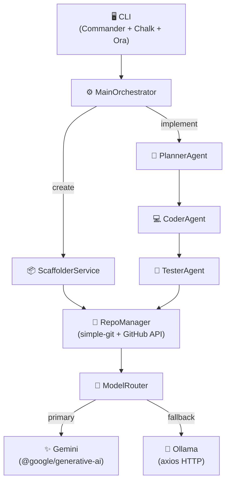

# EnginAI — Complete MVP Specification

**Version:** 4.0 (Node.js + TypeScript)  
**Date:** March 17, 2026  
**Scope:** Create applications from scratch + Implement features in existing apps  
**Timeline:** 8 weeks  
**Cost:** $0.00/month

---

## EXECUTIVE SUMMARY

### Problem
Developers lose time on:
1. **Creating initial project structure** (boilerplate, configuration)
2. **Implementing repetitive features** in existing projects (endpoints, CRUD, validations)

### MVP Solution
EnginAI **creates applications from scratch** and **implements simple features** in existing repositories, with a fully automated workflow. Built in **Node.js + TypeScript** for maximum ecosystem compatibility.

### MVP Scope (What it DOES)

**🆕 CREATE APPLICATIONS FROM SCRATCH:**
✅ REST API (FastAPI/Python, Express/TypeScript)  
✅ Basic Web App (Angular, React — initial structure)  
✅ Python/TypeScript Scripts (CLI with tests)  
✅ Automatic README generation via LLM  
✅ Docker + docker-compose  
✅ Git initialization with initial commit  

**🔧 IMPLEMENT FEATURES IN EXISTING APPS:**
✅ Read GitHub Issues  
✅ Analyze project structure  
✅ Add REST endpoints  
✅ Implement CRUD  
✅ Create functions/classes  
✅ Add validations  
✅ Generate unit tests (Jest / pytest)  
✅ Commit, push, and open PR  

### MVP Scope (What it DOES NOT DO — V1)
❌ Complex apps (microservices, distributed architectures)  
❌ RAG with Vector Store (deep context analysis)  
❌ Iterative automatic correction  
❌ Persistent memory between executions  
❌ Complex features (10+ files, large refactors)  
❌ Graphical interface (V2)  

---

## 1. ARCHITECTURE



---

## 2. MVP COMPONENTS

| Module | File | Responsibility |
|---|---|---|
| CLI | `src/cli/main.ts` | Commands: `create`, `implement`, `config` |
| MainOrchestrator | `src/core/orchestrator.ts` | Flow coordinator |
| ModelRouter | `src/core/modelRouter.ts` | Gemini → Ollama fallback + quota |
| PlannerAgent | `src/agents/planner.ts` | demand → Plan |
| CoderAgent | `src/agents/coder.ts` | Plan → FileChange[] |
| TesterAgent | `src/agents/tester.ts` | FileChange[] → test files |
| ScaffolderService | `src/services/scaffolder.ts` | Generate project structure |
| RepoManager | `src/adapters/repoManager.ts` | Git ops + GitHub PR |
| AppConfig | `src/config/index.ts` | .env loader |
| Types | `src/types/index.ts` | Shared interfaces |

---

## 3. TECH STACK

| Concern | Package | Why |
|---|---|---|
| Runtime | Node.js 20+ | LTS, native async, great ecosystem |
| Language | TypeScript 5.5+ | Types, safer refactors |
| CLI | Commander.js | Typed, best-in-class help generation |
| Terminal | Chalk + Ora | Colors + spinners |
| LLM (primary) | `@google/generative-ai` | Free Gemini API |
| LLM (fallback) | `axios` + Ollama HTTP | Local, zero cost |
| Git | `simple-git` | Best Node.js Git wrapper |
| Validation | Zod | Runtime + TypeScript type inference |
| Templating | Nunjucks | Jinja2-compatible, project scaffolding |
| Tests | Jest + `ts-jest` | Standard TypeScript test runner |
| Linting | ESLint + prettier | Code quality |

---

## 4. AVAILABLE TEMPLATES

### `api-fastapi` (Python + FastAPI)

```
{{project_name}}/
├── src/main.py            # FastAPI app + /health + /
├── tests/
├── requirements.txt
├── Dockerfile             # python:3.11-slim
└── README.md              # LLM-generated
```

### `api-express` (TypeScript + Express)

```
{{project_name}}/
├── src/app.ts             # Express app + /health
├── tests/
├── package.json
├── Dockerfile             # node:20-alpine
└── README.md              # LLM-generated
```

### `webapp-angular`

```
{{project_name}}/
├── src/
├── package.json
└── README.md
```

### `script-typescript`

```
{{project_name}}/
├── src/index.ts           # ts-node CLI
└── README.md
```

---

## 5. ENVIRONMENT

```bash
# === REQUIRED ===
GEMINI_API_KEY=AIzaSy_xxxxx     # https://aistudio.google.com/apikey
GITHUB_TOKEN=ghp_xxxxx          # https://github.com/settings/tokens (repo + workflow)

# === OPTIONAL (have defaults) ===
APP_ENV=dev
WORKDIR=~/.enginai/workspace
DEFAULT_BASE_BRANCH=main
CREATE_DRAFT_PR=true
GEMINI_DAILY_LIMIT=1450
OLLAMA_HOST=http://localhost:11434
OLLAMA_MODEL=qwen2.5-coder:7b
DEFAULT_AUTHOR=Your Name
DEFAULT_LICENSE=MIT
```

---

## 6. IMPLEMENTATION PLAN (8 WEEKS)

### Sprint 1 (Weeks 1–2): Foundation + Templates
- [ ] Project setup: `package.json`, `tsconfig.json`, ESLint, Prettier
- [ ] CLI: `create`, `implement`, `config` commands
- [ ] `RepoManager`: init, clone, branch, commit, push
- [ ] Template Engine: Nunjucks loader + variable substitution
- [ ] 3 base templates: `api-fastapi`, `api-express`, `webapp-angular`
- [ ] Tests: coverage ≥ 60% — Issue [#1](https://github.com/ElioNeto/enginai/issues/1)

### Sprint 2 (Weeks 3–4): Scaffolder + LLM Integration
- [ ] `ModelRouter`: Gemini SDK + Ollama via axios + quota + fallback
- [ ] `ScaffolderService`: template rendering + LLM-generated files
- [ ] LLM-generated README, auth module, initial tests
- [ ] Tests: coverage ≥ 70% — Issue [#7](https://github.com/ElioNeto/enginai/issues/7)

### Sprint 3 (Weeks 5–6): Implement Mode
- [ ] `PlannerAgent`: `createPlan(demand, repoPath) → Plan`
- [ ] `CoderAgent`: `implementPlan(plan, repoPath) → FileChange[]`
- [ ] `TesterAgent`: `generateTests(changes, repoPath) → string[]`
- [ ] `ExecutorService`: detect + run linter/typecheck/tests
- [ ] Tests: coverage ≥ 75% — Issue [#10](https://github.com/ElioNeto/enginai/issues/10)

### Sprint 4 (Weeks 7–8): GitHub Integration + Polish
- [ ] GitHub Provider: read Issues via API, create PRs
- [ ] `MainOrchestrator`: wire all modules together
- [ ] UX: spinners, phase labels, confirmation prompts
- [ ] Robust error handling + actionable messages
- [ ] E2E tests: real CREATE + IMPLEMENT scenarios
- [ ] Tests: coverage ≥ 80% — Issue [#15](https://github.com/ElioNeto/enginai/issues/15)

**Delivery: Week 9 — MVP v1.0.0 🚀**

---

## 7. COMPLETE USE CASES

### Case 1: Create TypeScript API

```bash
enginai create \
  --type api \
  --name user-service \
  --language typescript \
  --framework express
```

```
✅ Project created at: ./user-service
📁 Project path: /Users/elio/user-service
```

### Case 2: Create Python API

```bash
enginai create \
  --type api \
  --name analytics-api \
  --language python \
  --framework fastapi \
  --database postgres \
  --auth
```

### Case 3: Implement Feature from Issue

```bash
enginai implement \
  --repo "https://github.com/user/api" \
  --issue "https://github.com/user/api/issues/42"
```

Flow: clone → plan → confirm → implement → tests → commit + PR  
**Time:** ~3–5 minutes

### Case 4: Implement from Text

```bash
enginai implement \
  --repo "https://github.com/user/api" \
  --text "add GET /health endpoint returning 200 with { status: 'ok' }"
```

---

## 8. MVP LIMITATIONS

❌ Complex apps (distributed microservices)  
❌ RAG / deep analysis (10+ files) — coming in V1  
❌ Iterative auto-correction — coming in V1  
❌ Persistent memory — coming in V1  
❌ Advanced features (multi-repo, monorepos) — V2  

---

## 9. ACCEPTANCE CRITERIA

### CREATE
✅ Given a `create` command, generates a valid project structure  
✅ README generated by LLM reflects actual project config  
✅ Git repo initialized with initial commit  

### IMPLEMENT
✅ Given an Issue or text, implements simple feature in 1–3 files  
✅ Clone → plan → code → tests → validate → PR created  

### Success Metrics
- CREATE success rate: > 95%
- IMPLEMENT success rate: > 70%
- Average CREATE time: < 3 minutes
- Average IMPLEMENT time: < 5 minutes
- Cost: $0.00
- Test coverage: ≥ 80%

---

## 10. POST-MVP ROADMAP

### V1 (Weeks 9–14): Complex Features + RAG
- ✅ Auto-correction (3 attempts)
- ✅ RAG with vector store (FAISS or Gemini Embeddings)
- ✅ Persistent memory (`better-sqlite3`)
- ✅ Pattern Learner
- ✅ More templates (React, Vue, Django)
- ✅ Complex features (5–10 files)

### V2 (Weeks 15–18): GUI + Advanced
- ✅ GUI: Electron + Angular
- ✅ Multi-repo support
- ✅ IDE integrations (VSCode extension)
- ✅ Customizable templates + marketplace

---

**Document updated:** March 17, 2026  
**Runtime:** Node.js 20+ + TypeScript 5.5+  
**Status:** Active development — Sprint 3–4  
**Monthly cost:** $0.00
