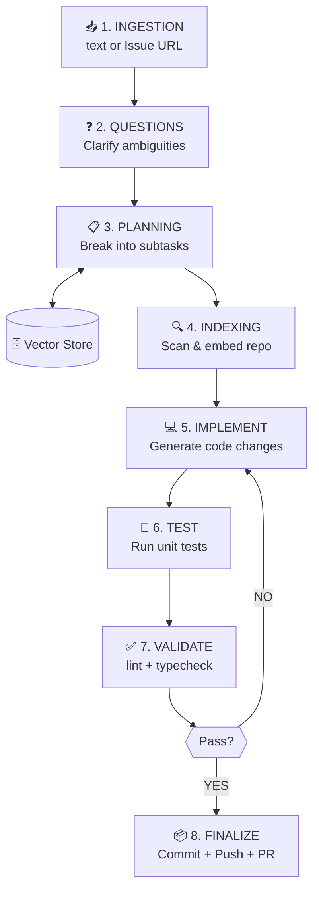
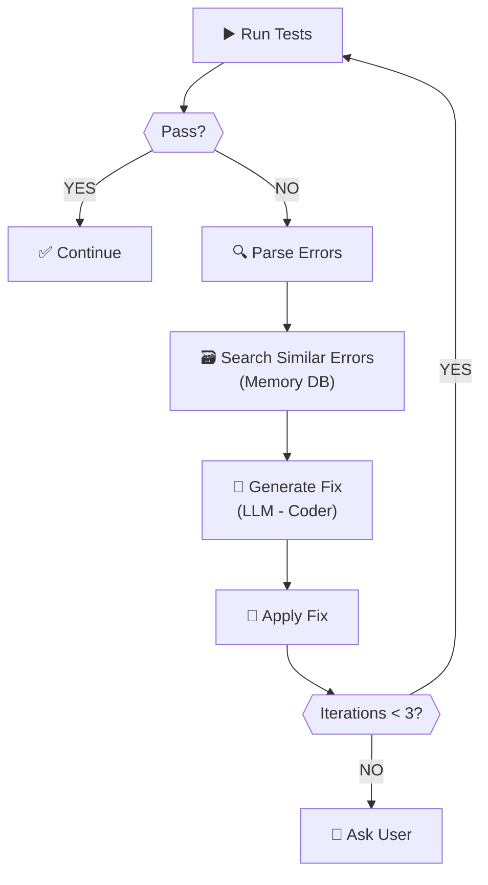

# EnginAI — Technical Specification & Implementation Plan

**Version:** 1.0  
**Date:** January 22, 2026  
**Author:** Technical specification for EnginAI

---

## PRODUCT VISION

Build an application that receives a demand (free text or an Issue), understands and breaks it into subtasks, implements code changes with unit tests, runs validations, commits/pushes, and opens a PR. The system should maintain project memory and learn from past failures, continuously explaining what it is doing and asking for confirmation when necessary.

**Target audience:** Developers working with Python, Angular/TypeScript, automations, and processing scripts (e.g., ffmpeg).

---

## 1. SYSTEM ARCHITECTURE

### 1.1 Architecture Overview

The system adopts a **hierarchical agent architecture with feedback loop and shared RAG**, where a central orchestrator coordinates specialized agents that collaborate in iterative cycles until acceptance criteria are met.

```
┌─────────────────────────────────────────────────────────────┐
│                     ORCHESTRATOR                            │
│                  (Central Coordinator)                      │
└────────────┬────────────────────────────────────────────────┘
             │
    ┌────────┴────────┐
    │                 │
┌───▼────┐      ┌────▼─────┐      ┌──────────┐
│Planner │      │  Coder   │      │ Reviewer │
│ Agent  │◄────►│  Agent   │◄────►│  Agent   │
└───┬────┘      └────┬─────┘      └──────┬───┘
    │                │                   │
    │         ┌──────▼──────┐            │
    └────────►│   Executor  │◄───────────┘
              │   Service   │
              └──────┬──────┘
                     │
    ┌────────────────┼────────────────┐
    │                │                │
┌───▼────┐    ┌─────▼─────┐    ┌────▼─────┐
│ Vector │    │   Repo    │    │ Project  │
│ Store  │    │  Manager  │    │  Memory  │
└────────┘    └───────────┘    └──────────┘
```

### 1.2 Architectural Layers

**Layer 1: Interface (UI Layer)**
- CLI: Rich-based terminal UI with progress bars, tables, and interactive prompts
- GUI: Electron/Tauri with Angular frontend
- Local REST API (optional): for IDE integration

**Layer 2: Orchestration (Domain Layer)**
- MainOrchestrator: end-to-end flow (ingestion → planning → execution → PR)
- TaskCoordinator: manages subtask queues and dependencies
- FeedbackLoop: implements automatic correction cycles

**Layer 3: Agents (Domain Services)**
- PlannerAgent: decomposes demand into a structured plan
- CoderAgent: code generation and modifications
- ReviewerAgent: quality analysis and suggestions
- TestAgent: test creation and execution

**Layer 4: Services (Application Services)**
- IndexerService: chunking, embeddings, vector indexing
- ExecutorService: command execution (lint/test/build)
- RepoManager: Git operations (clone, branch, commit, push, PR)
- MemoryService: context persistence and learning

**Layer 5: Adapters (Infrastructure)**
- GitProviders: GitHub, GitLab, Bitbucket
- LLMProviders: OpenAI, Anthropic, Ollama, etc.
- VectorStores: FAISS, ChromaDB, LanceDB
- EmbeddingProviders: OpenAI, HuggingFace, local

**Layer 6: Data (Persistence)**
- SQLite: metadata, memory, history
- File System: workspace, cache, indexes
- Remote: Git repos, object storage (optional)

---

## 2. CORE MODULES

### 2.1 Orchestrator Module

**Responsibility:** Coordinate the complete end-to-end flow.

**Components:**
- `MainOrchestrator`: entry point, manages phases (ingest → plan → execute → finalize)
- `PhaseManager`: state machine for phase transitions
- `CheckpointManager`: save/restore state between phases
- `ConfirmationHandler`: request user approvals

**Interface:**
```python
class MainOrchestrator:
    async def execute_task(
        self,
        input: TaskInput,  # text or Issue
        mode: ExecutionMode,  # plan_only | execute | auto
        checkpoint_file: Optional[Path] = None
    ) -> ExecutionResult
```

**Data Models:**
```python
@dataclass
class TaskInput:
    type: Literal["text", "issue"]
    content: str
    repository_url: Optional[str]
    issue_number: Optional[int]
    attachments: List[Attachment]

@dataclass
class ExecutionResult:
    status: Literal["completed", "partial", "failed"]
    plan: Plan
    changes: List[FileChange]
    tests_results: TestResults
    pr_url: Optional[str]
    checkpoints: List[Checkpoint]
```

---

### 2.2 Planner Module

**Responsibility:** Transform a demand into an executable plan with subtasks.

**Components:**
- `DemandAnalyzer`: extract requirements and identify ambiguities
- `TaskDecomposer`: break into subtasks with dependencies (DAG)
- `AcceptanceCriteriaGenerator`: define validations per subtask
- `QuestionGenerator`: formulate clarification questions

**Interface:**
```python
class PlannerAgent:
    async def create_plan(
        self,
        demand: str,
        repo_context: RepoContext,
        memory: ProjectMemory
    ) -> Plan

    async def generate_questions(
        self,
        demand: str,
        repo_context: RepoContext
    ) -> List[Question]
```

**Data Models:**
```python
@dataclass
class Plan:
    id: str
    title: str
    description: str
    subtasks: List[SubTask]
    dependencies: Dict[str, List[str]]  # DAG
    estimated_duration: timedelta

@dataclass
class SubTask:
    id: str
    title: str
    description: str
    files_to_modify: List[str]
    test_strategy: str
    acceptance_criteria: List[str]
    validation_commands: List[str]
    risks: List[str]
```

---

### 2.3 Indexer & Vector Store Module

**Responsibility:** Process the full repo, create embeddings, and enable semantic search.

**Components:**
- `RepoScanner`: read file tree, detect languages/frameworks
- `Chunker`: split files into semantic chunks
- `EmbeddingGenerator`: generate embeddings (batch)
- `VectorStoreManager`: CRUD on the vector index
- `SemanticRetriever`: search for relevant context

**Interface:**
```python
class IndexerService:
    async def index_repository(
        self,
        repo_path: Path,
        force_reindex: bool = False
    ) -> IndexStats

    async def search_similar(
        self,
        query: str,
        k: int = 5,
        filters: Optional[Dict] = None
    ) -> List[SearchResult]
```

**Chunking Strategy:**
- Base size: 512 tokens (adjustable per language)
- Overlap: 50 tokens
- Respect structure: complete classes/functions when possible
- Filters: ignore `node_modules/`, `dist/`, `.venv/`, `build/`, `*.min.js`, etc.

**Per-chunk Metadata:**
```python
@dataclass
class ChunkMetadata:
    file_path: str
    chunk_index: int
    start_line: int
    end_line: int
    language: str
    file_type: str  # source | test | config
    symbols: List[str]  # detected functions/classes
    timestamp: datetime
```

**Supported Vector Stores:**
- **FAISS** (default): local, fast, zero cost
- **ChromaDB**: local, simple API, great for development
- **LanceDB + S3**: production, scalable
- **PostgreSQL + pgvector**: if already using Postgres

---

### 2.4 Repo Manager Module

**Responsibility:** Git operations and PR creation.

**Components:**
- `GitClient`: wrapper over GitPython/pygit2
- `BranchManager`: create/delete branches
- `CommitBuilder`: consistent messages (Conventional Commits optional)
- `PRCreator`: open PR via provider API
- `ConflictResolver`: detect conflicts and guide resolution

**Interface:**
```python
class RepoManager:
    async def setup_workspace(
        self,
        repo_url: str,
        base_branch: str
    ) -> Path

    async def create_feature_branch(
        self,
        branch_name: str
    ) -> str

    async def apply_changes(
        self,
        changes: List[FileChange]
    ) -> None

    async def commit_and_push(
        self,
        message: str,
        co_authors: Optional[List[str]] = None
    ) -> str  # commit SHA

    async def create_pull_request(
        self,
        title: str,
        body: str,
        base: str,
        draft: bool
    ) -> PullRequest
```

**Data Models:**
```python
@dataclass
class FileChange:
    operation: Literal["create", "update", "delete"]
    path: str
    content: Optional[str]
    original_sha: Optional[str]  # for updates

@dataclass
class PullRequest:
    number: int
    url: str
    title: str
    body: str
    draft: bool
```

---

### 2.5 Executor Module

**Responsibility:** Run external tools (lint, test, typecheck) and capture results.

**Components:**
- `CommandRunner`: execute commands with timeout and capture
- `ToolDetector`: identify tools available in the project
- `OutputParser`: interpret stdout/stderr from known tools
- `ErrorDiagnoser`: analyze errors and suggest fixes

**Interface:**
```python
class ExecutorService:
    async def detect_tools(
        self,
        repo_path: Path
    ) -> DetectedTools

    async def run_linter(
        self,
        files: Optional[List[str]] = None
    ) -> LintResult

    async def run_type_checker(
        self
    ) -> TypeCheckResult

    async def run_tests(
        self,
        pattern: Optional[str] = None,
        coverage: bool = False
    ) -> TestResult
```

**Auto-detected Tools:**

| Language | Linter | Formatter | Typecheck | Test Runner |
|---|---|---|---|---|
| Python | ruff/flake8/pylint | black/ruff | mypy/pyright | pytest/unittest |
| TypeScript | eslint | prettier | tsc | jest/vitest |
| JavaScript | eslint | prettier | — | jest/mocha |
| Go | golangci-lint | gofmt | go build | go test |
| Rust | clippy | rustfmt | cargo check | cargo test |

---

### 2.6 Coder Agent Module

**Responsibility:** Generate/modify code based on subtasks.

**Components:**
- `CodeGenerator`: create new files
- `CodeModifier`: apply edits (using AST when possible)
- `DiffGenerator`: produce readable diffs
- `ContextRetriever`: search similar examples in the repo via vector store

**Interface:**
```python
class CoderAgent:
    async def implement_subtask(
        self,
        subtask: SubTask,
        repo_context: RepoContext,
        relevant_chunks: List[SearchResult]
    ) -> List[FileChange]

    async def fix_error(
        self,
        error: ExecutionError,
        current_code: str,
        context: str
    ) -> FileChange
```

**Generation Flow:**
1. Retrieve relevant context (vector search)
2. Generate changes with LLM
3. Validate basic syntax
4. Return FileChanges

---

### 2.7 Test Agent Module

**Responsibility:** Create/update unit tests.

**Components:**
- `TestScaffolder`: create test structure for new files
- `TestGenerator`: generate test cases based on code
- `TestUpdater`: update existing tests
- `CoverageAnalyzer`: analyze coverage and identify gaps

**Interface:**
```python
class TestAgent:
    async def generate_tests(
        self,
        code_changes: List[FileChange],
        test_framework: str
    ) -> List[FileChange]  # test files

    async def analyze_coverage(
        self,
        coverage_file: Path
    ) -> CoverageReport
```

**Red/Green Pattern:**
- Always try to run tests before changing code (when applicable)
- Confirm that new tests fail before the fix
- Validate that they pass after the fix

---

### 2.8 Memory & Context Module

**Responsibility:** Maintain history, learning, and project context.

**Components:**
- `MemoryStore`: SQLite persistence
- `DecisionLogger`: record technical decisions
- `ErrorTracker`: track recurring errors
- `PatternLearner`: extract patterns from the repo (naming, structure, etc.)

**Interface:**
```python
class MemoryService:
    async def store_execution(
        self,
        execution: ExecutionResult
    ) -> None

    async def get_project_patterns(
        self,
        repo_url: str
    ) -> ProjectPatterns

    async def record_error_resolution(
        self,
        error: ExecutionError,
        resolution: str
    ) -> None

    async def query_similar_errors(
        self,
        error: ExecutionError
    ) -> List[ErrorResolution]
```

**SQLite Schema:**
```sql
-- Executions
CREATE TABLE executions (
    id TEXT PRIMARY KEY,
    repo_url TEXT,
    branch TEXT,
    demand TEXT,
    status TEXT,
    created_at TIMESTAMP,
    completed_at TIMESTAMP
);

-- Decisions
CREATE TABLE decisions (
    id TEXT PRIMARY KEY,
    execution_id TEXT,
    subtask_id TEXT,
    decision TEXT,
    rationale TEXT,
    alternatives TEXT,
    FOREIGN KEY (execution_id) REFERENCES executions(id)
);

-- Errors and Resolutions
CREATE TABLE error_resolutions (
    id TEXT PRIMARY KEY,
    execution_id TEXT,
    error_type TEXT,
    error_message TEXT,
    file_path TEXT,
    resolution_strategy TEXT,
    success BOOLEAN,
    created_at TIMESTAMP,
    FOREIGN KEY (execution_id) REFERENCES executions(id)
);

-- Project Patterns
CREATE TABLE project_patterns (
    id TEXT PRIMARY KEY,
    repo_url TEXT,
    pattern_type TEXT,  -- naming | structure | testing | etc
    pattern_data JSON,
    confidence FLOAT,
    updated_at TIMESTAMP
);
```

---

### 2.9 Model Router Module

**Responsibility:** Route requests to different LLMs based on the task.

**Components:**
- `ModelRegistry`: register available providers and models
- `TaskClassifier`: classify task type
- `RoutingStrategy`: decide which model to use
- `FallbackHandler`: switch provider on failure

**Interface:**
```python
class ModelRouter:
    async def complete(
        self,
        prompt: str,
        task_type: TaskType,
        max_tokens: int,
        temperature: float = 0.7
    ) -> CompletionResult

    def register_provider(
        self,
        provider: LLMProvider
    ) -> None
```

**Routing Strategy:**

| Task | Ideal Model | Characteristics |
|---|---|---|
| Planning | GPT-4 / Claude-3.5 | Complex reasoning |
| Code generation | GPT-4 / Claude-3.5 / Codestral | Precision, long context |
| Error fixing | GPT-4 / Claude-3.5 | Debugging, analysis |
| Log summarization | GPT-3.5 / Llama 3 70B | Cost-effectiveness |
| Test generation | GPT-4 / Claude-3.5 | Coverage, edge cases |
| Code review | GPT-4 / Claude-3.5 | Critical analysis |

**Fallback:**
- If primary provider fails → try secondary
- Maintain essential context (do not resend full history)
- Log failures for analysis

---

## 3. EXTERNAL INTERFACES

### 3.1 Git Providers

**GitProvider Interface:**
```python
class GitProvider(ABC):
    @abstractmethod
    async def get_issue(self, repo: str, number: int) -> Issue

    @abstractmethod
    async def create_pull_request(
        self,
        repo: str,
        title: str,
        body: str,
        head: str,
        base: str,
        draft: bool
    ) -> PullRequest

    @abstractmethod
    async def link_pr_to_issue(
        self,
        repo: str,
        pr_number: int,
        issue_number: int
    ) -> None
```

**Implementations:**
- `GitHubProvider`: via PyGithub or httpx directly
- `GitLabProvider`: via python-gitlab
- `BitbucketProvider`: via requests

---

### 3.2 LLM Providers

**LLMProvider Interface:**
```python
class LLMProvider(ABC):
    @abstractmethod
    async def complete(
        self,
        messages: List[Message],
        model: str,
        max_tokens: int,
        temperature: float,
        tools: Optional[List[Tool]] = None
    ) -> CompletionResponse
```

**Implementations:**
- `OpenAIProvider`: via openai SDK
- `AnthropicProvider`: via anthropic SDK
- `OllamaProvider`: via httpx
- `AzureOpenAIProvider`: via openai SDK with custom endpoint

---

### 3.3 Vector Stores

**VectorStore Interface:**
```python
class VectorStore(ABC):
    @abstractmethod
    async def add_documents(
        self,
        documents: List[Document],
        embeddings: List[List[float]],
        metadatas: List[Dict]
    ) -> List[str]  # IDs

    @abstractmethod
    async def search(
        self,
        query_embedding: List[float],
        k: int,
        filters: Optional[Dict] = None
    ) -> List[SearchResult]

    @abstractmethod
    async def delete(self, ids: List[str]) -> None
```

**Implementations:**
- `FAISSStore`: local, .index file
- `ChromaStore`: ChromaDB client
- `LanceDBStore`: LanceDB + optional S3

---

## 4. CONFIGURATION & SECURITY

### 4.1 .env File (Template)

```bash
# Environment
APP_ENV=dev
LOG_LEVEL=INFO
WORKDIR=~/.enginai/workspace

# Git
GIT_PROVIDER=github
GITHUB_TOKEN=ghp_xxxxx
GITHUB_BASE_URL=https://api.github.com
DEFAULT_BASE_BRANCH=main
CREATE_DRAFT_PR=true

# Embeddings
EMBEDDING_PROVIDER=openai
EMBEDDING_MODEL=text-embedding-3-small
EMBEDDING_BATCH_SIZE=100

# Vector Store
VECTOR_STORE=faiss
VECTOR_DB_PATH=~/.enginai/vectordb
MAX_FILES_INDEX=10000
IGNORE_GLOBS=node_modules/**,dist/**,.venv/**,build/**,*.min.js

# LLM Routing
LLM_PROVIDER_PRIMARY=openai
LLM_PROVIDER_SECONDARY=ollama
LLM_MODEL_PLANNER=gpt-4-turbo
LLM_MODEL_CODER=gpt-4-turbo
LLM_MODEL_REVIEWER=gpt-4-turbo
LLM_MODEL_SUMMARIZER=gpt-3.5-turbo
OPENAI_API_KEY=sk-xxxxx

# Ollama (local fallback)
OLLAMA_HOST=http://localhost:11434
OLLAMA_MODEL=codellama:34b

# Executor
TEST_COMMAND_OVERRIDE=
LINT_COMMAND_OVERRIDE=
MAX_EXECUTION_TIME=300

# Memory
MEMORY_DB_PATH=~/.enginai/memory.db
ENABLE_LEARNING=true
```

### 4.2 Security

**Secret Redaction:**
- Regex to detect: `(token|key|password|secret)[=:]\s*[^\s]+`
- Replace with `***REDACTED***` in logs and PRs
- Never persist env vars in database

**Mandatory Confirmations:**
- Delete files
- Force push
- Modify more than 50 files
- Execute commands with sudo/admin

**Sandboxing:**
- Run commands in isolated subprocesses
- Default timeout: 5 minutes
- Limit memory usage (via cgroups on Linux, optional)

---

## 5. DATA FLOW

### 5.1 Complete Flow (End-to-End)



### 5.2 Auto-Correction Loop



---

## 6. CORE DATA MODELS

```python
@dataclass
class RepoContext:
    """Complete repository context"""
    url: str
    local_path: Path
    base_branch: str
    languages: List[str]
    frameworks: List[str]
    test_framework: Optional[str]
    lint_tools: List[str]
    dependencies: Dict[str, List[str]]  # package manager → packages
    folder_structure: Dict[str, Any]
    patterns: ProjectPatterns

@dataclass
class ProjectPatterns:
    """Detected patterns in the project"""
    naming_convention: str  # snake_case | camelCase | PascalCase
    test_file_pattern: str  # test_*.py | *.test.ts
    folder_structure_type: str  # flat | nested | feature-based
    import_style: str
    code_style: Dict[str, Any]

@dataclass
class Checkpoint:
    """Saved state for recovery"""
    phase: str
    timestamp: datetime
    data: Dict[str, Any]
    success: bool

@dataclass
class ExecutionError:
    """Error captured during execution"""
    type: str  # lint | typecheck | test | build
    message: str
    file: Optional[str]
    line: Optional[int]
    stack_trace: Optional[str]
    severity: Literal["error", "warning"]
```

---

## 7. IMPLEMENTATION PLAN

### MVP (Minimum Viable Product) — 4–6 weeks

**Goal:** Functional system for simple demands, no GUI, basic validation.

#### Sprint 1–2: Foundation
- [ ] Project setup: folder structure, poetry/pip, pre-commit hooks
- [ ] Config manager: load .env, validate required variables
- [ ] Basic CLI: text input, display progress (Rich library)
- [ ] Repo Manager: clone, create branch, commit, push (no PR yet)
- [ ] Executor Service: run commands, capture output

#### Sprint 3–4: Core Agents
- [ ] Planner Agent: receive demand → generate simple plan (no complex DAG)
- [ ] Coder Agent: implement subtask → FileChanges
- [ ] Model Router: OpenAI + fallback to Ollama
- [ ] Basic loop: plan → implement → test (1 iteration, no auto-correction)

#### Sprint 5–6: Integration & Testing
- [ ] GitHub Provider integration: read Issue, create PR
- [ ] Test Agent: generate basic tests (pytest)
- [ ] Validation: run pytest and capture result
- [ ] End-to-end: simple demand → functional PR
- [ ] System unit tests (coverage > 60%)

**MVP Deliverable:**
- CLI that accepts text or Issue
- Generates plan, asks for confirmation
- Implements simple changes
- Creates basic tests
- Opens PR on GitHub

---

### V1 (Production-Ready) — 8–12 weeks

**Goal:** Robust system with auto-correction, vector store, memory.

#### Sprint 7–8: Vector Store & RAG
- [ ] Indexer Service: scan repo, chunking, embeddings
- [ ] FAISS integration: create/save/load index
- [ ] Semantic search: retrieve context before generating code
- [ ] Incremental indexing: reindex only modified files

#### Sprint 9–10: Auto-Correction
- [ ] Feedback Loop: implement correction cycle (max 3 attempts)
- [ ] Error Diagnoser: parsers for pytest, eslint, mypy, etc.
- [ ] Memory Service: SQLite schema, store/query executions
- [ ] Pattern Learner: automatically detect repo patterns

#### Sprint 11–12: Robustness & Quality
- [ ] Checkpoint system: save state, allow resume
- [ ] Confirmations: destructive actions, large changes
- [ ] Secret redaction: detect and mask
- [ ] Reviewer Agent: quality analysis before PR
- [ ] Structured logs: optional JSON output
- [ ] Test coverage > 80%

**V1 Deliverable:**
- Auto-correction of errors (up to 3 attempts)
- RAG with vector store for rich context
- Persistent memory between executions
- Security and confirmations
- Ready for production use (real projects)

---

### V2 (Advanced Features) — 12–16 weeks

**Goal:** GUI, multi-language, advanced integrations.

#### Sprint 13–14: Graphical Interface
- [ ] Electron/Tauri setup
- [ ] Angular frontend: main components
  - Dashboard: status, progress
  - Plan Viewer: subtask tree
  - Diff Viewer: syntax-highlighted diffs
  - Test Results: test table
- [ ] WebSocket: real-time CLI ↔ GUI communication
- [ ] State sync: same execution visible in CLI and GUI

#### Sprint 15–16: Expansion
- [ ] More language support: Go, Rust, Java
- [ ] GitLab and Bitbucket providers
- [ ] ChromaDB / LanceDB as FAISS alternatives
- [ ] IDE integrations: VSCode extension (optional)
- [ ] CI/CD integration: run as GitHub Action
- [ ] Telemetry: usage metrics (optional, opt-in)

**V2 Deliverable:**
- Complete and user-friendly GUI
- Support for multiple languages and Git providers
- Extensibility via plugins
- Integration with development tools

---

## 8. OPEN DECISIONS

### Critical Questions (Blockers)

#### 1. Business Model & Licensing
**Question:** Will the software be open-source (MIT/Apache) or proprietary? Will there be a paid/enterprise version?  
**Recommendation:** Open-source (Apache 2.0) with an "open-core" model (optional paid enterprise features: cloud sync, analytics, team features).

#### 2. Default Embedding Provider
**Question:** Which embedding provider to use by default? OpenAI (paid, high quality) or local (free, lower quality)?  
**Options:**
- OpenAI `text-embedding-3-small` (~$0.02/1M tokens, fast, accurate)
- HuggingFace local (`sentence-transformers/all-MiniLM-L6-v2`, free, ~400MB RAM)
- Ollama local (`nomic-embed-text`, free, requires Ollama)  
**Recommendation:** OpenAI by default (best experience), with fallback to HuggingFace local if API key is not configured.

#### 3. Repository Size Limit
**Question:** What is the indexing limit? Should repos with 100k+ files be supported?  
**Recommendation:**
- Default: up to 10k files (configurable via `MAX_FILES_INDEX`)
- For larger repos: allow selective indexing (e.g., only `src/`, `lib/`)
- Warning if limit is exceeded

#### 4. Memory Versioning Strategy
**Question:** Is memory global per repo or per branch? Does learning from one branch contaminate another?  
**Recommendation:** Hybrid — base repo memory + branch-specific context override.

---

### Important Questions (Medium Impact)

#### 5. Commit Message Format
**Question:** Enforce Conventional Commits or allow free format?  
**Recommendation:** Detect if the repo already uses Conventional Commits (via history) and adapt. If not detected, use free descriptive format.

#### 6. Integration Test Execution
**Question:** Run integration tests automatically or only unit tests?  
**Recommendation:** MVP — unit tests only. V1 — allow optionally with `--run-integration` flag.

#### 7. Handling Secrets in Code
**Question:** If the agent detects hardcoded secrets in existing code, should it alert? Auto-fix?  
**Recommendation:** Always alert, but never auto-fix (risk of breaking functionality). Suggest migration to .env.

#### 8. Multi-Repo Support
**Question:** Support changes across multiple repositories in a single demand? (e.g., API + Frontend)  
**Recommendation:** Not in MVP. V2 — support with cross-repo orchestration.

---

### User Experience Questions

#### 9. Default Verbosity Level
**Question:** Should the CLI be verbose by default or silent (progress only)?  
**Recommendation:** Moderate — show main phases + progress bars. `--verbose` mode for debugging.

#### 10. Execution Cancellation
**Question:** Allow Ctrl+C at any time? How to handle partial state?  
**Recommendation:**
- Ctrl+C → automatically save checkpoint
- Next execution → ask "Resume previous execution?"
- `--clean` option to ignore checkpoints

#### 11. Automatic Agent Updates
**Question:** Should the CLI automatically check for updates? Auto-update?  
**Recommendation:** Check on startup (non-blocking), display notification. No auto-update (user decides via `pip install --upgrade enginai`).

---

### Technical Implementation Questions

#### 12. AST vs String Manipulation
**Question:** For code modification, use AST parsing (more precise, complex) or regex/LLM directly (simpler, risk of breaking)?  
**Recommendation:** Hybrid — Python/TypeScript: try AST first (`ast`/`babel`), fallback to LLM. Other languages: LLM directly with subsequent syntax validation.

#### 13. LLM API Rate Limiting
**Question:** How to handle rate limits (e.g., OpenAI 500 req/min)?  
**Recommendation:**
- Implement retry with exponential backoff
- Batch requests when possible
- Show transparent progress ("Waiting for rate limit...")

#### 14. Python/Node Environment Isolation
**Question:** Create virtualenv/node_modules automatically or assume it already exists?  
**Recommendation:** Detect and use existing. If none, alert user and guide creation (do not create automatically — may conflict with workflow).

---

## 9. DETAILED FUNCTIONAL REQUIREMENTS

### 9.1 Demand Input & Understanding
- Accept requests as free text (e.g., "create a REST API for user registration")
- Read Issues from Git provider (priority: GitHub)
- If ambiguous, ask objective questions before starting
- Support contextual attachments: log snippets, stack traces, links, and local files

### 9.2 Task Planning (Planner)
- Transform demand into a plan with clear subtasks, acceptance criteria, and dependencies
- Per subtask: probable files, test strategy, risks, validations
- Reviewable plan: always present and ask "confirm / adjust"

### 9.3 Repository Operations (Repo Manager)
- Clone repository (HTTPS/SSH), check base branch, create working branch
- Create/edit/delete code files, configs, and tests
- Commit with consistent messages (Conventional Commits optional)
- Push to remote and open Pull Request
- Link PR to Issue and include description with summary, tests, and impacts

### 9.4 Processing & Semantic Search (Indexer + Vector Store)
- Process full project: file tree, detect languages/frameworks/patterns
- Create embeddings and local vector index (FAISS default)
- Chunking with configurable size/overlap, ignore vendor/artifacts
- Persist index and allow incremental reindex

### 9.5 Code Execution (Executor)
- Generate changes in cycles: implement → test → validate → fix
- Use project tools: test runner, linter, formatter, typecheck
- Capture output, interpret errors, suggest and apply fixes
- Safe mode (read-only) and apply-changes mode

### 9.6 Mandatory Unit Tests
- Create/update appropriate tests for every activity
- Ensure red/green pattern when possible
- Report coverage and gaps

### 9.7 Validation & Auto-Correction
- Local pipeline: lint → typecheck → unit tests
- On failure: diagnosis with cause, file/line, hypothesis, and plan
- Repeat loop until acceptance or request user intervention

### 9.8 Memory & Context (Project Memory)
- History: decisions, recurring errors, commands, patterns
- Learn from failures: post-mortem and heuristics
- Local persistence (SQLite/JSONL) scoped per repo/branch/issue

### 9.9 Interface (CLI + GUI)
- CLI: progress, structured logs, verbose mode, confirmations
- GUI: plan, diffs, results, control buttons
- Both: explain actions in plain language, indicate status

### 9.10 Multi-Model (Model Router)
- Support multiple models (cloud via API, local via Ollama)
- Task-based routing: fast/strong/cheap model as needed
- Fallback: switch provider while maintaining context

---

## 10. NON-FUNCTIONAL REQUIREMENTS

### 10.1 Security
- Never expose secrets in logs, PRs, or prompts
- Automatically redact tokens/keys when capturing logs
- Confirm destructive actions and critical Git operations

### 10.2 Reliability
- Idempotent operations when possible
- Checkpoints: save state between steps

### 10.3 Performance
- Incremental indexing and embedding cache
- Support for large repositories (configurable limits)

### 10.4 Portability
- Run on Windows/Linux/macOS
- Simple installation (CLI) and optional GUI

### 10.5 Observability
- Structured logs (optional JSON), levels (INFO/WARN/ERROR)
- Final report per execution

### 10.6 Extensibility
- Modular architecture: Git Provider, Vector Store, Embeddings, Test Runners, Model Providers

---

## 11. RECOMMENDED TECH STACK

### Core
- **Language:** Python 3.11+
- **Dependency Manager:** Poetry
- **Data Validation:** Pydantic v2
- **Async Runtime:** asyncio + aiohttp

### CLI
- **Interface:** Rich (progress bars, tables, prompts)
- **Args Parsing:** Click or Typer

### Git
- **Library:** GitPython or pygit2

### Vector Store
- **Default:** FAISS (local)
- **Alternatives:** ChromaDB, LanceDB

### LLM Providers
- **OpenAI:** openai SDK
- **Anthropic:** anthropic SDK
- **Ollama:** httpx (HTTP direct)

### Persistence
- **Memory:** SQLite
- **ORM:** SQLAlchemy (optional) or raw SQL

### GUI (V2)
- **Runtime:** Electron or Tauri
- **Frontend:** Angular + TypeScript
- **Communication:** WebSocket (Socket.IO or native)

### Testing
- **Framework:** pytest
- **Coverage:** pytest-cov
- **Mocking:** pytest-mock

---

## 12. NEXT STEPS

1. **Validate critical decisions** (questions 1–4) with stakeholders
2. **Create architectural prototype** (1-week spike):
   - Basic Orchestrator
   - OpenAI integration
   - Simple FAISS indexing
   - Git clone + commit
3. **Project setup:**
   - Create repository
   - Folder structure
   - Poetry init
   - Pre-commit hooks (black, ruff, mypy)
4. **Start MVP Sprint 1**

---

## 13. PRODUCT ACCEPTANCE CRITERIA

### For MVP
- [ ] Given a real Issue, the agent clones the repo, indexes it, proposes a plan
- [ ] User can confirm/adjust the plan
- [ ] Agent implements, creates tests, runs validations
- [ ] Agent commits, pushes, and opens a PR
- [ ] PR contains: description, change summary, executed tests

### For V1
- [ ] On test failure, agent iterates and fixes (up to 3x)
- [ ] Persistent memory: previous executions inform decisions
- [ ] Functional RAG: relevant context retrieved before generating code
- [ ] Security: confirmations for destructive actions, masked secrets
- [ ] Functional structured logs and checkpoints

### For V2
- [ ] GUI and CLI maintain the same state
- [ ] Support for 5+ languages (Python, TS, JS, Go, Rust)
- [ ] 3+ Git providers (GitHub, GitLab, Bitbucket)
- [ ] Extensible via plugins
- [ ] Complete documentation + examples

---

**Document generated on:** January 22, 2026  
**Status:** Draft — Awaiting validation of critical decisions  
**Next review:** After Sprint 1
