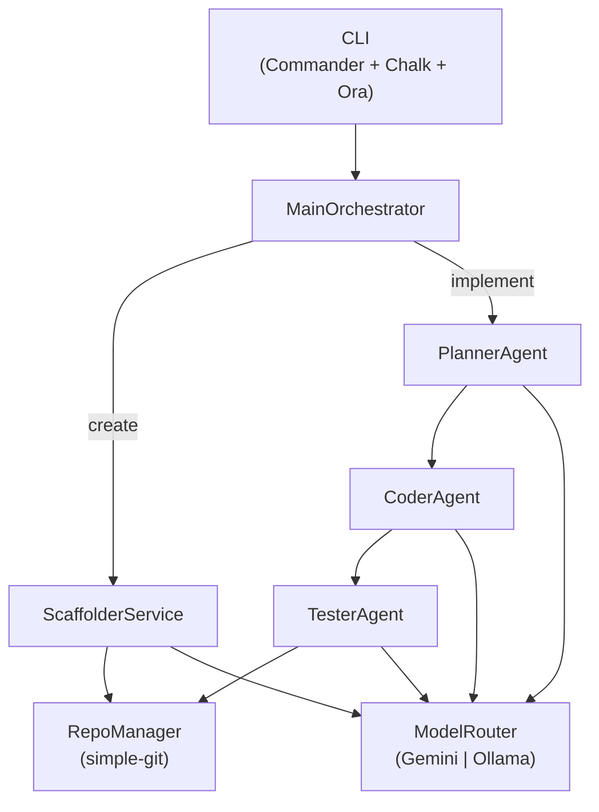
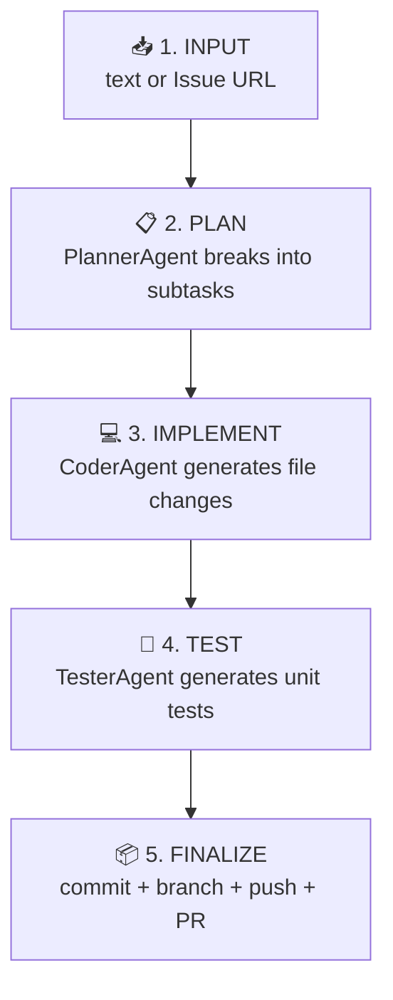
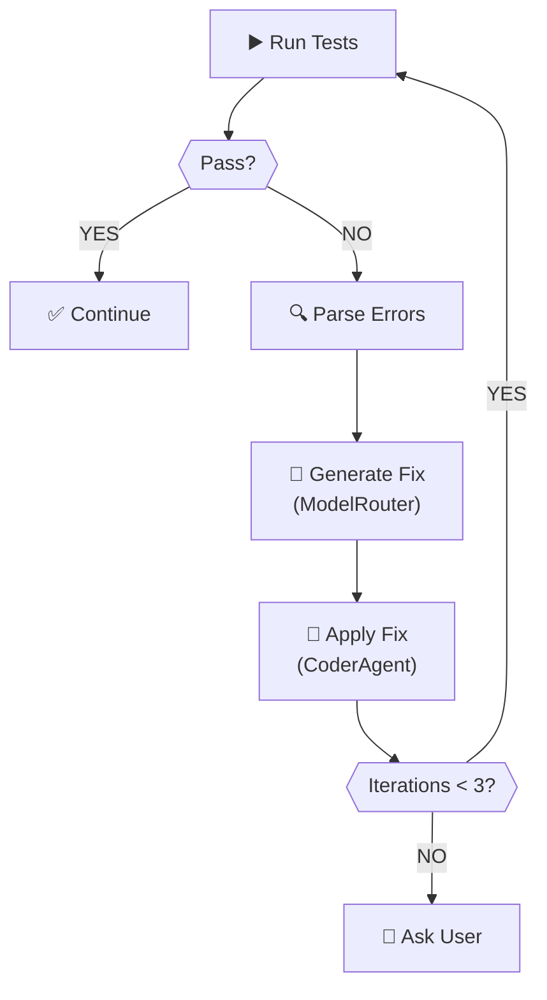

# EnginAI — Technical Specification & Implementation Plan

**Version:** 2.0 (Node.js + TypeScript)  
**Date:** March 17, 2026  
**Author:** Technical specification for EnginAI

---

## PRODUCT VISION

Build an application that receives a demand (free text or an Issue), understands and breaks it into subtasks, implements code changes with unit tests, runs validations, commits/pushes, and opens a PR. The system should maintain project memory and learn from past failures, continuously explaining what it is doing and asking for confirmation when necessary.

**Target audience:** Developers working with TypeScript/JavaScript, Python, Angular, and automation scripts.

---

## 1. SYSTEM ARCHITECTURE

### 1.1 Architecture Overview

The system adopts a **hierarchical agent architecture with feedback loop**, where a central orchestrator coordinates specialized agents that collaborate in iterative cycles until acceptance criteria are met.



### 1.2 Architectural Layers

**Layer 1: Interface**
- CLI: Commander.js with Chalk (colors) and Ora (spinners)
- GUI: Electron + Angular (V2)

**Layer 2: Orchestration**
- `MainOrchestrator`: end-to-end flow coordinator (create & implement)

**Layer 3: Agents**
- `PlannerAgent`: decomposes demand into a structured `Plan`
- `CoderAgent`: generates and modifies code files (`FileChange[]`)
- `TesterAgent`: generates Jest/pytest unit tests

**Layer 4: Services**
- `ScaffolderService`: project structure generation from templates
- `ExecutorService` (V1): lint, typecheck, test runner

**Layer 5: Adapters**
- `RepoManager`: Git operations via `simple-git` + GitHub REST API via `axios`
- `ModelRouter`: routes prompts to Gemini or Ollama

**Layer 6: Data**
- File system: workspace, generated projects, quota tracking
- SQLite (V1): execution memory and learned patterns

---

## 2. CORE MODULES

### 2.1 Orchestrator (`src/core/orchestrator.ts`)

**Responsibility:** Coordinate the complete CREATE and IMPLEMENT flows.

```typescript
class MainOrchestrator {
  async createProject(
    projectType: string,
    name: string,
    language: string,
    framework?: string,
    database?: string,
    includeAuth?: boolean,
  ): Promise<CreateResult>

  async implementFeature(
    repoUrl: string,
    issueUrl?: string,
    text?: string,
  ): Promise<ImplementResult>
}
```

---

### 2.2 Planner Agent (`src/agents/planner.ts`)

**Responsibility:** Transform a demand into an executable `Plan` with subtasks.

```typescript
class PlannerAgent {
  async createPlan(demand: string, repoPath: string): Promise<Plan>
}

interface Plan {
  title: string
  description: string
  subtasks: SubTask[]
}

interface SubTask {
  id: string
  title: string
  description: string
  filesToModify: string[]
  acceptanceCriteria: string[]
}
```

---

### 2.3 Coder Agent (`src/agents/coder.ts`)

**Responsibility:** Implement subtasks as concrete file changes.

```typescript
class CoderAgent {
  async implementPlan(plan: Plan, repoPath: string): Promise<FileChange[]>
}

interface FileChange {
  path: string
  content: string
  operation: 'create' | 'update' | 'delete'
}
```

**Generation Flow:**
1. Read existing file content (if any)
2. Build prompt with file context + subtask description + acceptance criteria
3. Call `ModelRouter.complete()` with `task_type: 'coding'`
4. Extract code from markdown block in response
5. Write file to disk and add to `FileChange[]`

---

### 2.4 Tester Agent (`src/agents/tester.ts`)

**Responsibility:** Generate unit test files for every `FileChange`.

```typescript
class TesterAgent {
  async generateTests(changes: FileChange[], repoPath: string): Promise<string[]>
}
```

- Detects language from file extension (`.ts` → Jest, `.py` → pytest)
- Generates `<name>.test.ts` or `test_<name>.py` in `tests/`
- Requires: happy path + at least 1 edge case per function

---

### 2.5 Model Router (`src/core/modelRouter.ts`)

**Responsibility:** Route LLM calls to Gemini (primary) or Ollama (fallback).

```typescript
class ModelRouter {
  async complete(
    prompt: string,
    taskType: TaskType,
    maxTokens?: number,
    temperature?: number,
  ): Promise<LLMResponse>
}

type TaskType = 'planning' | 'coding' | 'testing' | 'review'

interface LLMResponse {
  response: string
  model: string
  provider: 'gemini' | 'ollama'
  tokens?: number
}
```

**Routing Strategy:**

| Task | Gemini Model | Ollama Fallback |
|---|---|---|
| planning | gemini-1.5-pro | deepseek-r1:7b |
| coding | gemini-1.5-pro | qwen2.5-coder:7b |
| testing | gemini-1.5-flash | qwen2.5-coder:7b |
| review | gemini-1.5-flash | qwen2.5-coder:7b |

- Daily quota tracked in `~/.enginai/quota.json`
- Automatic reset at midnight
- Exponential backoff on transient errors

---

### 2.6 Scaffolder Service (`src/services/scaffolder.ts`)

**Responsibility:** Generate complete project structures with LLM-customized files.

```typescript
class ScaffolderService {
  async generateStructure(opts: ScaffoldOptions): Promise<string>
}

interface ScaffoldOptions {
  projectType: string  // api | webapp | script
  name: string
  language: string     // python | typescript
  framework?: string   // fastapi | express | angular | react
  database?: string    // postgres | mysql | sqlite
  includeAuth?: boolean
}
```

**Supported templates:**

| Type | Language | Framework | Output |
|---|---|---|---|
| api | python | fastapi | FastAPI + pytest + Docker |
| api | typescript | express | Express + Jest + Docker |
| webapp | typescript | angular | Angular CLI structure |
| script | typescript | — | ts-node CLI script |

---

### 2.7 Repo Manager (`src/adapters/repoManager.ts`)

**Responsibility:** Git operations and PR creation via GitHub API.

```typescript
class RepoManager {
  async cloneRepo(url: string, branch?: string): Promise<string>
  async initRepo(path: string): Promise<void>
  async createBranch(path: string, name: string): Promise<void>
  async commit(path: string, message: string): Promise<void>
  async createPullRequest(opts: PullRequestOptions): Promise<string | null>
}
```

- Uses `simple-git` for all local Git operations
- Uses `axios` + GitHub REST API for PR creation
- Branch naming: `feature/<plan-title-slugified>`

---

### 2.8 CLI (`src/cli/main.ts`)

**Commands:**

```bash
enginai create -t <type> -n <name> [-l <lang>] [-f <framework>] [-d <db>] [--auth]
enginai implement -r <repo-url> [-i <issue-url> | -x <text>]
enginai config [--check]
```

- Built with **Commander.js**
- Colors via **Chalk**
- Progress spinners via **Ora**
- All commands are fully `async`

---

## 3. SHARED TYPES (`src/types/index.ts`)

```typescript
export type TaskType = 'planning' | 'coding' | 'testing' | 'review'
export type FileOperation = 'create' | 'update' | 'delete'

export interface LLMResponse {
  response: string
  model: string
  provider: 'gemini' | 'ollama'
  tokens?: number
}

export interface FileChange {
  path: string
  content: string
  operation: FileOperation
}

export interface SubTask {
  id: string
  title: string
  description: string
  filesToModify: string[]
  acceptanceCriteria: string[]
}

export interface Plan {
  title: string
  description: string
  subtasks: SubTask[]
}

export interface AppConfig {
  appEnv: string
  workdir: string
  githubToken: string
  defaultBaseBranch: string
  createDraftPr: boolean
  geminiApiKey: string
  geminiDailyLimit: number
  ollamaHost: string
  ollamaModel: string
  defaultAuthor: string
  defaultLicense: string
}
```

---

## 4. CONFIGURATION & ENVIRONMENT

### .env Template

```bash
# Environment
APP_ENV=dev
LOG_LEVEL=INFO
WORKDIR=~/.enginai/workspace

# Git
GITHUB_TOKEN=ghp_xxxxx
DEFAULT_BASE_BRANCH=main
CREATE_DRAFT_PR=true

# Gemini (primary, free)
GEMINI_API_KEY=AIzaSy_xxxxx
GEMINI_DAILY_LIMIT=1450

# Ollama (local fallback)
OLLAMA_HOST=http://localhost:11434
OLLAMA_MODEL=qwen2.5-coder:7b

# Templates
TEMPLATES_DIR=~/.enginai/templates
DEFAULT_AUTHOR=Your Name
DEFAULT_LICENSE=MIT
```

### Security

- Secrets are never logged or committed
- Destructive operations (delete file, force push) require user confirmation
- GitHub token scopes required: `repo`, `workflow`

---

## 5. DATA FLOW

### 5.1 Complete Flow (End-to-End)



### 5.2 Auto-Correction Loop (V1)



---

## 6. TECH STACK

### Core

| Concern | Package | Version |
|---|---|---|
| Runtime | Node.js | 20+ |
| Language | TypeScript | 5.5+ |
| CLI framework | Commander.js | 12.x |
| Terminal output | Chalk + Ora | 5.x / 8.x |
| Schema validation | Zod | 3.x |

### LLM Integration

| Provider | Package |
|---|---|
| Gemini | `@google/generative-ai` |
| Ollama | `axios` (HTTP direct) |

### Git

| Concern | Package |
|---|---|
| Local Git ops | `simple-git` |
| GitHub API (PRs) | `axios` |

### Testing

| Concern | Package |
|---|---|
| Test runner | Jest + `ts-jest` |
| Type checking | TypeScript strict mode |
| Linting | ESLint + `@typescript-eslint` |
| Formatting | Prettier |

### Templating

| Concern | Package |
|---|---|
| Template engine | Nunjucks |

---

## 7. IMPLEMENTATION PLAN

### MVP — Sprint 1–4 (8 weeks)

#### Sprint 1 — Foundation (#1)
- [ ] Project setup: folder structure, `package.json`, pre-commit hooks
- [ ] CLI: `create` and `implement` commands (Commander + Chalk + Ora)
- [ ] `RepoManager`: clone, init, branch, commit, push
- [ ] Template Engine: Nunjucks loader + variable substitution
- [ ] Base templates: `api-fastapi`, `api-express`, `webapp-angular`
- [ ] Tests: coverage ≥ 60%

#### Sprint 2 — Scaffolder + LLM (#7)
- [ ] `ModelRouter`: Gemini SDK + Ollama via axios + fallback logic
- [ ] `ScaffolderService`: template rendering + LLM-generated files
- [ ] LLM-generated README, auth module, and initial tests
- [ ] Tests: coverage ≥ 70%

#### Sprint 3 — Implement Mode (#10)
- [ ] `PlannerAgent`: createPlan(demand, repoPath) → Plan
- [ ] `CoderAgent`: implementPlan(plan, repoPath) → FileChange[]
- [ ] `TesterAgent`: generateTests(changes, repoPath) → string[]
- [ ] `ExecutorService`: detect + run linter/typecheck/tests
- [ ] Tests: coverage ≥ 75%

#### Sprint 4 — GitHub Integration + Polish (#15)
- [ ] GitHub Provider: read Issues, create PRs via API
- [ ] `MainOrchestrator`: wire all modules together
- [ ] UX: Rich spinners, phase status, confirmations
- [ ] Error handling: all errors produce actionable messages
- [ ] E2E tests: real CREATE and IMPLEMENT scenarios
- [ ] Tests: coverage ≥ 80%
- [ ] **Delivery: MVP v1.0.0 🚀**

---

### V1 — Weeks 9–14

- [ ] Auto-correction loop (max 3 attempts)
- [ ] RAG with FAISS (Python subprocess bridge or `faiss-node`)
- [ ] Persistent memory (SQLite via `better-sqlite3`)
- [ ] Pattern Learner: detect naming convention, test style
- [ ] More templates: React, Vue, Django
- [ ] Complex features (5–10 files)

---

### V2 — Weeks 15–18

- [ ] GUI: Electron + Angular
- [ ] WebSocket: real-time CLI ↔ GUI
- [ ] Multi-repo support
- [ ] IDE integrations (VSCode extension)
- [ ] GitLab + Bitbucket providers

---

## 8. OPEN DECISIONS

### Critical

1. **RAG in V1:** Node.js lacks native FAISS/sentence-transformers. Options: (a) call a Python microservice, (b) use `faiss-node` (limited), (c) use a cloud vector DB (Pinecone free tier). **Recommendation:** Python subprocess bridge for V1, evaluate `faiss-node` maturity.

2. **Embedding provider:** With Node.js, the best zero-cost options are `@xenova/transformers` (local, WASM-based) or Gemini Embeddings API. **Recommendation:** Gemini Embeddings for V1 (already integrated), fallback to `@xenova/transformers`.

3. **Business model:** Open-source (MIT) with optional paid cloud features. No changes from V1 spec.

---

### Implementation

4. **AST vs string manipulation:** For TypeScript files, use `ts-morph` for precise AST-based edits. For Python files generated by EnginAI, use LLM + syntax validation. **Default:** LLM-based with `tsc --noEmit` or `ast.parse` as guard.

5. **Commit message format:** Auto-detect Conventional Commits from repo history. Default: `feat: <plan title>`.

6. **Rate limiting:** Exponential backoff already implemented in `ModelRouter`. For Ollama, no rate limiting needed.

---

## 9. ACCEPTANCE CRITERIA

### MVP
- [ ] `enginai create --type api --name my-api --language typescript --framework express` produces a runnable project
- [ ] `enginai implement --repo <url> --text "add GET /health"` opens a real PR
- [ ] All errors produce actionable, user-friendly messages
- [ ] Test coverage ≥ 80%

### V1
- [ ] On test failure, agent iterates and fixes (up to 3 attempts)
- [ ] RAG retrieves relevant context before generating code
- [ ] Persistent memory informs decisions across executions
- [ ] Structured logs and checkpoints functional

### V2
- [ ] GUI and CLI maintain the same execution state
- [ ] Support for 3+ languages (TypeScript, Python, Go)
- [ ] 3+ Git providers (GitHub, GitLab, Bitbucket)

---

**Document updated:** March 17, 2026  
**Stack:** Node.js 20+ + TypeScript 5.5+  
**Status:** MVP in active development (Sprint 3–4)
